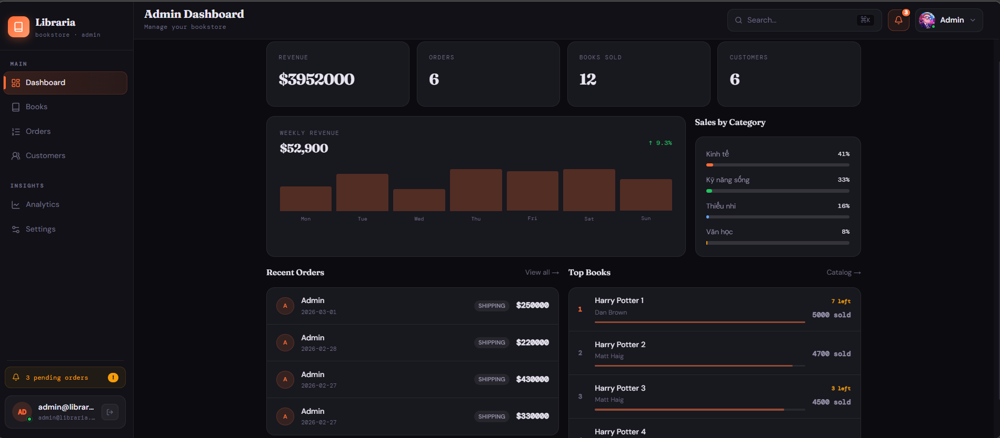
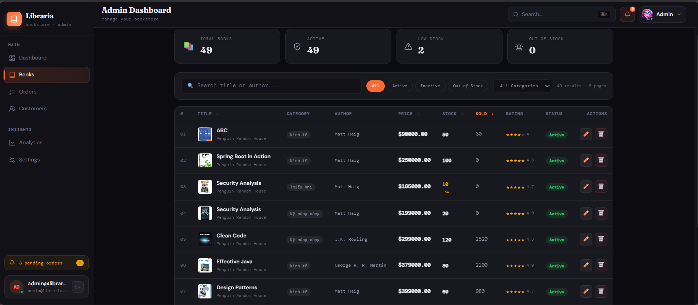

# 📚 Bookshop Online

A **full-stack online bookstore system** built with **modern technologies**, focusing on scalability, security, and clean architecture.

---

## 🚀 Tech Stack

### 🔹 FrontendK

* **ReactJS** + **TypeScript**
* **Vite** (fast build tool)
* **Tailwind CSS** (utility-first styling)
* **shadcn/ui** (accessible & reusable UI components)
* **Axios** (API communication)

### 🔹 Backend

* **Spring Boot**
* **Spring Security (JWT + Refresh Token)**
* **Spring Data JPA (Hibernate)**
* **MySQL**
* **Redis** (caching & token support)
* **OpenAPI / Swagger** (API documentation)

### 🔹 DevOps

* **Docker & Docker Compose**

---

## ✨ Key Features

## 🛠️ Admin Dashboard

### 📦 Product Management

### 👤 Authentication & Authorization


* User **Register / Login**
* **JWT Access Token**
* **Refresh Token** mechanism
* Role-based access control (`ROLE_USER`, `ROLE_ADMIN`)
* Secure password hashing with **BCrypt**

### 📖 Book Management

* List books with pagination
* Book detail page
* Book rating & reviews
* Categories, authors, publishers

### ⭐ Review System

* Users can review books
* Rating from 1–5 stars
* Nested replies (parent-child reviews)

### ⚡ Performance & Reliability

* Redis caching for frequently accessed data
* Centralized **Global Exception Handling**
* Validation with **Jakarta Validation**

### 📑 API Documentation

* Swagger UI powered by **OpenAPI**
* Clear request/response models

---

## 🏗️ Project Architecture

### Backend (Monolithic)

```
backend/
├── config/
├── controller/
├── dto/
├── entity/
├── exception/
├── filter/
├── repository/
├── service/
├── utils/
└── BackendApplication.java
```

### Frontend

```
frontend-user/
├── components/
├── pages/
├── services/
├── routes/
├── stores/
├── layouts/
├── contexts/
├── hooks/
├── types/
└── main.tsx
```
```
frontend-admin/
├── components/
├── pages/
├── services/
├── routes/
├── stores/
├── layouts/
├── contexts/
├── hooks/
├── types/
└── main.tsx
```

---

## 🔐 Security Flow (JWT)

1. User login → receive **access token + refresh token**
2. Access token used for API requests
3. When access token expires → call `/auth/refresh`
4. Server validates refresh token → issue new access token

---

## 🧪 Validation & Error Handling

* Request body validation with annotations (`@NotBlank`, `@Email`, ...)
* Centralized error handling via `@RestControllerAdvice`
* Consistent error response format

Example error response:

```json
{
  "timestamp": "2026-01-08T10:30:00",
  "status": 400,
  "error": "Bad Request",
  "message": "Validation failed",
  "errors": {
    "email": "Email is invalid"
  }
}
```

---

## 🐳 Docker Setup

### Run the whole system

```bash
docker-compose up -d
```

Services:

* MySQL
* Redis
* Backend (Spring Boot)
* Frontend (React)

---

## 📄 API Documentation

After running backend:

```
http://localhost:8686/swagger-ui.html
```

---

## 🧑‍💻 Author

**Bùi Khánh Lân**
Backend Developer | Java | Spring Boot | Microservices(basic)

---

## 📌 Future Improvements

* CI/CD pipeline
* Microservices migration

---

⭐ If you find this project useful, feel free to give it a star!
